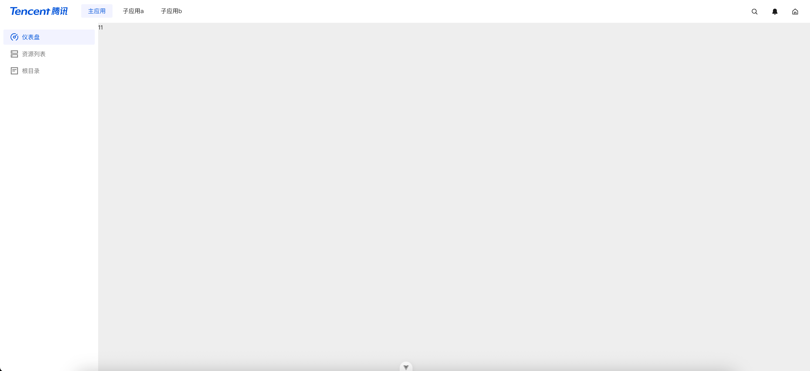

# microApp 微前端模板示例 vue3-vite-tdesign
## micro-app-main 主应用
  - 负责layout(子应用只显示content部分) 、菜单渲染、子应用渲染切换 
## micro-app-sub-a 子应用a
  - 接收主应用路由变更进行路由跳转
## micro-app-sub-b 子应用b
  - 接收主应用路由变更进行路由跳转

## 示例

